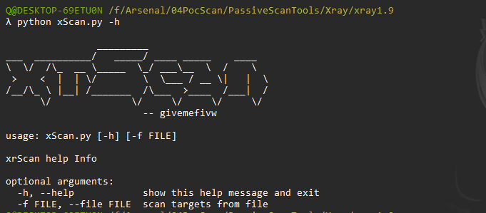

## 202208更新成可批量

Windows具有"start cmd /k"新开窗口的特性，所以比较简单的代码就可实现批量：

首先会新开窗口打开xray，进行监听，接着在脚本运行窗口会运行rad对文本url内容进行扫描，流量给到xray端口，实现批量。

# Usage

```JavaScript
λ python xScan.py -h

                _________
___  __________/   _____/ ____ _____    ____
\  \/  /\_  __ \_____  \_/ ___\__  \  /    \
 >    <  |  | \/        \  \___ / __ \|   |  \
/__/\_ \ |__| /_______  /\___  >____  /___|  /
      \/              \/     \/     \/     \/
                        -- givemefivw

usage: xScan.py [-h] [-f FILE]

xrScan help Info

optional arguments:
  -h, --help            show this help message and exit
  -f FILE, --file FILE  scan targets from file
```

很简单，只有一个参数，指定目标文本就可进行批量：



# Installation

```JavaScript
git clone https://github.com/givemefivw/XradScan.git
cd XradScan
python3 xScan.py -f url.txt
```

# Config

只需要将xray和rad放在同一目录下即可，注意两者的配置文件，有的网站默认不允许爬取，视情况修改配置文件。