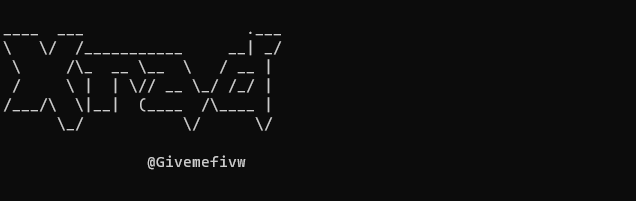

XradScan自述文档

------

# XradScan

XradScan即是将xray和rad联动，启动xray监听端口，利用http-proxy将rad扫描带入xray，实现联动。



# Who Use XradScan

那必须是渗透测试人员啦。

其实主要是为了方便批量进行漏扫，之前写过一个类似的简单脚本AutoXray`https://github.com/givemefivw/AutoXray`，同样是为了方便批量扫描。

# How It Works

其实我觉得这一项不必要写。

观察源码就可以看到，就是使用了os.system(我都没用subprocess)调用xray和rad工具执行命令。

啥？技术点？

那没有2333

# Update

最开始是想批量扫描，但是发现想的太简单了。。。

其一是rad工具并没有支持扫描文本内目标，那么如果想要实现批量扫描就只能调用命令，这就造成了冲突问题，明明开了两个rad但只能爬取其中一个，当一个运行完成之后另一个也无法继续爬取，暂时没想到方法去解决。

其二是经过实验，一旦运行xrad调用了xray和rad工具，笔记本的CPU可以说一瞬间就拉满了。。。（一大部分是笔记本自身性能问题）

所以还是只能扫描一个目标，参数变成了指定url

# Usage

```JavaScript
____  ___                  .___
\   \/  /___________     __| _/
 \     /\_  __ \__  \   / __ |
 /     \ |  | \// __ \_/ /_/ |
/___/\  \|__|  (____  /\____ |
      \_/           \/      \/

                @Givemefivw

usage: XradScan.py [-h] [-u URL]

Xrad Scan Help

optional arguments:
  -h, --help         show this help message and exit
  -u URL, --url URL  Please set the target url
```

很简单，只有一个参数，指定目标网址就可以开始扫描了。


# Installation

```JavaScript
git clone https://github.com/givemefivw/XradScan.git
cd XradScan
python3 XradScan.py -u http://www.baidu.com/
```

# Config

只需要将xray和rad放在同一目录下即可，注意两者的配置文件，有的网站默认不允许爬取，视情况修改配置文件。